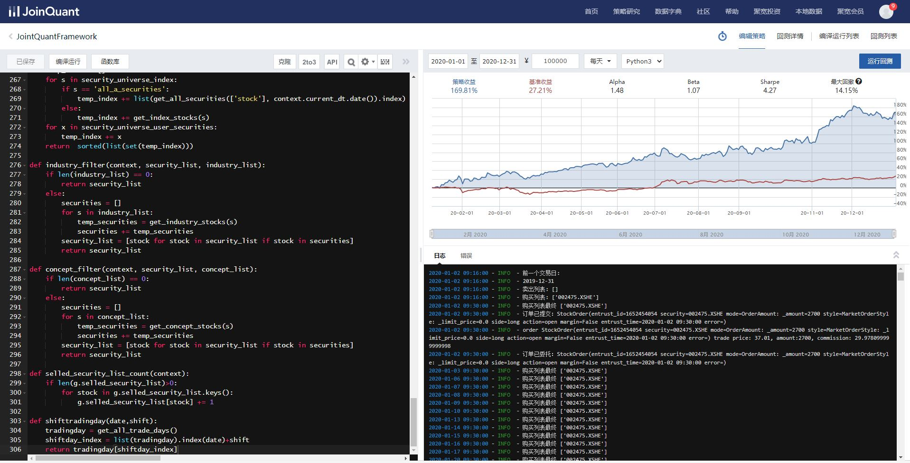

# JointQuantFramework
`JointQuantFramework.py`的使用
* 登录网站：`https://www.joinquant.com/`
* 进入`导航栏-策略研究-策略列表`：`https://www.joinquant.com/algorithm/index/list`
* 点击新建策略
* 左侧策略代码编辑区域，复制粘贴`JointQuantFramework.py`，保存
* 回测设置
  * 时间：2020年1月1日-2020年12月31日
  * 金额：100000
  * 频率：每天
  * python：python3
  * 点击`运行回测`
回测结果如下：

